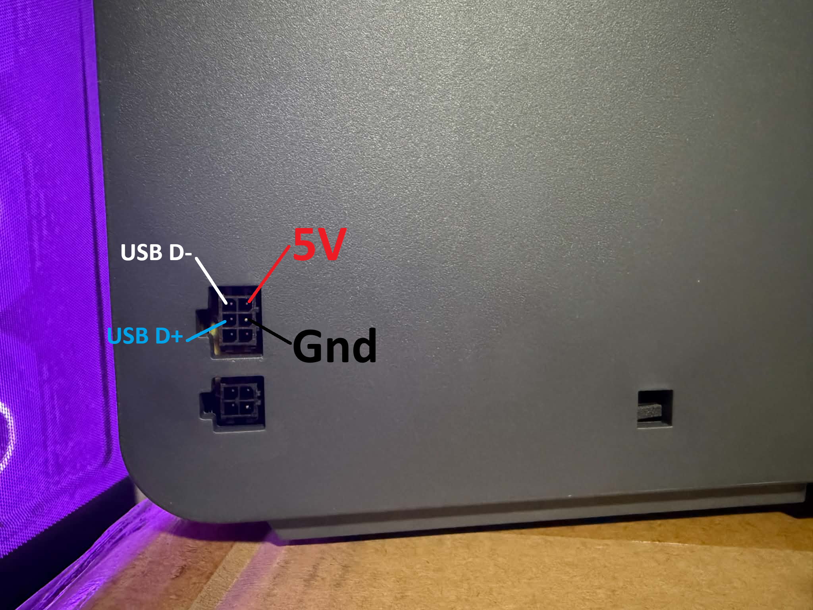
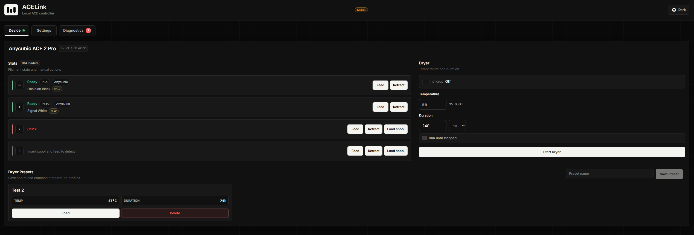

# ACELink

Standalone local-network controller for Anycubic ACE Pro and ACE 2 Pro filament changers.

ACELink lets an ACE unit be controlled without a printer. A host computer stays connected to the ACE, runs ACELink, and serves a web UI on your local network.

> **Disclaimer:** You are responsible for your own hardware, wiring, and use of this project. I am not responsible for damage to your ACE, host computer, adapter, printer, or other equipment.

---

## Supported Models

| Model | Protocol | Baud Rate | Connection |
|---|---|---|---|
| Anycubic ACE Pro | JSON over serial | 115200 | USB cable → 6-pin connector |
| Anycubic ACE 2 Pro | Protobuf over serial | 230400 | USB-to-RS485 adapter → 6-pin connector |

Both models share the same 6-pin Micro-Fit 3.0 2x3P signal connector, but use different electrical paths. ACE 2 Pro tested and validated on real hardware.

---

## Hardware Connection

### Connector Pinout



```
ACE-side 6-pin signal connector, front/mating side
Clip/latch side at the top

             clip/latch
                ||
      +-------------------+
      | [NC]  [D+]  [D-]  |
      | [NC]  [GND] [5V]  |
      +-------------------+
```

**Warning:** The `5V` pin is shown for identification only. Do not connect it. Connecting `5V` can damage the ACE, adapter, or host USB port.

### ACE Pro Wiring

ACE Pro uses a direct USB data path:

| USB cable wire | ACE Pro signal connector |
|---|---|
| USB `D-` | `D-` |
| USB `D+` | `D+` |
| USB `GND` | `GND` |
| USB `5V` | Do not connect |

### ACE 2 Pro Wiring

ACE 2 Pro requires a USB-to-RS485 adapter. Community-validated with CH340-based adapters:

| Adapter label | ACE 2 Pro signal | Notes |
|---|---|---|
| `GND` | Ground | Always required |
| `A` (`485+`) | `D+` or `D-` | Swap if commands time out |
| `B` (`485-`) | The other of `D+`/`D-` | Swap if commands time out |
| `VCC` | Do not connect | Always leave disconnected |

**If the adapter enumerates but ACE commands time out:** keep `GND` connected and swap the `A`/`B` pair. A working link will show real temperature and status values.

---

## Quick Start

### Requirements

- Python 3.11+
- Node.js (for frontend build)

### Install

```bash
# macOS / Linux
scripts/install.sh

# Windows PowerShell
scripts/install.ps1
```

### Run

```bash
# Production mode
scripts/run.sh        # macOS / Linux
scripts/run.ps1       # Windows

# Mock mode (UI development, no hardware)
python main.py --debug
```

Open `http://localhost:8765` in a browser.

---

## Configuration

Configured in `acelink.config.json`. The web UI Settings tab provides a form for all options.

| Field | Default | Description |
|---|---|---|
| `port` | `8765` | Web UI port (restart required) |
| `device_model` | `auto` | `auto`, `ace_pro`, or `ace_2_pro` |
| `serial_port` | *(auto-detected)* | Serial device path |
| `baudrate` | `230400` | Baud rate hint for auto-detect |
| `scan_interval` | `15` | Polling interval in seconds |
| `protocol_debug` | `false` | Show raw serial bytes in logs |
| `load_length` | `2100` | Global load feed length (mm) |
| `retract_length` | `1950` | Global retract length (mm) |
| `feed_speed` | `80` | Global feed speed (mm/s) |
| `retract_speed` | `30` | Global retract speed (mm/s) |
| `slot_tuning` | *(array)* | Per-slot override for the above |

Dryer temperature limits are hard-coded per model:
- **ACE Pro**: 35–55°C
- **ACE 2 Pro**: 35–65°C

---

## Commands

All commands operate on the connected ACE device.

| Command | Slot | Description |
|---|---|---|
| Feed | per-slot | Push filament forward through the slot |
| Retract | per-slot | Pull filament back through the slot |
| Dryer Start | n/a | Start drying at specified temp/duration |
| Dryer Stop | n/a | Stop the dryer |
| Load Spool (manual) | per-slot | Manually mark a non-RFID spool as loaded |

The ACE 2 Pro RFID reader detects filament after a brief feed, populating type, color, and brand automatically. Manual "Load spool" is available for non-RFID filament.

---

## UI



Three tabs:

- **Device** — Slot status, filament info, feed/retract controls, dryer controls, presets
- **Settings** — App port, movement defaults, slot tuning
- **Diagnostics** — Hardware probe results and event log

### Dryer Presets

Save and recall temperature/duration profiles. The preset name is its identity — editing and saving with the same name updates the preset, a new name creates a new one.

---

## Development

```bash
# Run mock mode for UI development (no hardware)
python main.py --debug

# Build frontend
cd webui && npm run build

# Run tests
python -m unittest discover -s tests
```

---

## Credits

ACELink protocol and connectivity knowledge is derived from:
- [BlackFrogKok/SnapAce](https://github.com/BlackFrogKok/SnapAce)
- [hakimio/U1-Ace](https://github.com/hakimio/U1-Ace)
- [DnG-Crafts/U1-Ace](https://github.com/DnG-Crafts/U1-Ace)
- [decay71/multiACE](https://github.com/decay71/multiACE)
